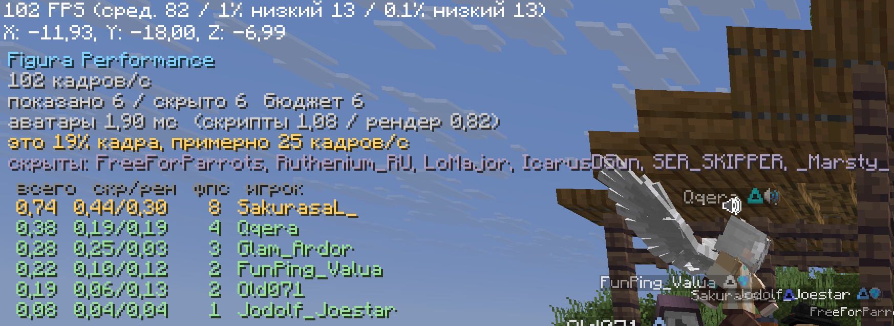

# Figura Performance

A client-side Fabric mod that decides how many Figura avatars are worth showing at once, so a crowd
of them stops eating your frame rate.

Nothing is needed on the server side, and other players do not need the mod. It only changes what
**your** client spends time on; how your own avatar looks to everyone else is untouched.



## What it is for

Figura already lets you block an individual player, or trust only your friends. What it cannot do is
answer the question a roleplay server actually poses: *show me whoever is around me right now, but
not twenty of them at once.* That is a moving target, and no list of names expresses it.

So this mod hides avatars by distance, by count and by whether you are even looking at them, and
brings them back the moment that changes.

## Why hiding, and only hiding

An avatar costs more than its model. For every player with one, Figura also saves and edits the
vanilla player model, walks its own layers for the head, elytra, held items and cape, and draws a
custom nameplate – every frame, with no distance or visibility test anywhere. All of that hangs off
a single lookup, which is why its panic button is so much faster than anything the renderer alone
could achieve.

A hidden avatar here fails that same lookup, so none of that work happens: it costs exactly nothing,
the same as panic, only per player instead of all at once.

Cutting an avatar down instead of hiding it was tried and dropped. Skipping its scripts, thinning
its animations and trimming its complexity broke how it looked – bodies that lean and follow the
camera turned jerky, parts went missing – and the frames saved were lost in the noise, because the
work around the avatar carried on regardless. On a live server with thirteen people, hiding the
avatars took a client from 100 frames to 135, where panic gave 143.

## What it does

**Distance and count.** Avatars past a distance are hidden, and only the nearest N are shown at all.
One count covers every situation: with two people around, a limit of twelve hides nobody, and it
only starts cutting once there is something to cut.

**Off screen.** Avatars behind you are hidden, and their per tick and per frame scripts stop with
them. Turn around and they are back within a tick. One-off events such as the avatar's setup when
its player first appears always go through, so an avatar that loaded out of sight still works.

**Adaptive mode.** The mod watches the frame rate and shows fewer avatars when it falls below the
target, more once it recovers.

**Lists.** Names that are always shown, whatever the limits say – for the people you are in a scene
with – and names that are never shown. Plus a key to hide whoever you are looking at, on the spot.

**Automatic hiding.** An avatar costing more than a set number of milliseconds a frame can be hidden
on its own, with a line in chat saying who and how much. Off by default.

**Render passes.** Avatars can be skipped in the shadow pass a shader pack draws, and in the paper
doll in the corner, which is a second full render of your own avatar every frame.

**Texture uploads.** Avatars that repaint textures from a script push them to the GPU on the frame
they change; a crowd of those is a stutter. Uploads are spread over frames instead.

**Diagnostics overlay.** Frame rate, how many avatars are shown and hidden, who exactly is hidden,
what the avatars cost in milliseconds and in frames, and a list of the most expensive ones by name,
with scripts and geometry counted separately. Figura can tell you how complex an avatar is; it
cannot tell you how many frames that person is costing you.

**Reloading avatars.** A button in the settings and a key reload every avatar at once, another key
reloads the one you are looking at – the same as Figura's own popup menu entry, without the popup.

**Broken avatars.** Figura 0.1.5 throws old avatars away on whatever thread the news arrived on:
the websocket when someone swaps their avatar, the HTTP pool when their data comes back. Off the
render thread closing the textures fails halfway, and the avatar is left without them until
reloaded by hand. The mod moves that cleanup to the render thread.

Your own avatar is never hidden by default.

## Keys

Nothing is bound out of the box. In the controls screen, under Figura Performance:

- turn the mod on or off
- toggle the diagnostics overlay
- hide the avatar you are looking at
- reload all avatars
- reload the avatar you are looking at

## Settings

Mod Menu, or the config file at `config/figura-performance.json`. With Cloth Config installed you
get the full screen; without it, a plain built-in one. Everything applies as you change it, and the
world stays visible behind the menu – with a crowd in front of you, that is the preview.

## What it does not do

It does not make Figura faster. Showing all twenty avatars *and* keeping the frames is not something
an add-on can do: it would mean caching geometry between frames, batching by texture and moving the
per player work off the render thread, all of which live inside Figura and would need a fork.

## Building

The mixins target Figura's own classes, so its jar has to be present to compile against. Modrinth
only carries Figura up to 1.21.4, so fetch the Fabric build for 1.21.8 from the Figura releases,
drop it into `libs/`, and point `figura_jar` in `gradle.properties` at it. Then:

```
./gradlew build
```

The jar lands in `build/libs`. Minecraft 1.21.8, Fabric Loader 0.16 or newer, Java 21, Fabric API
and Figura.

## Licence

LGPL-3.0-or-later.
